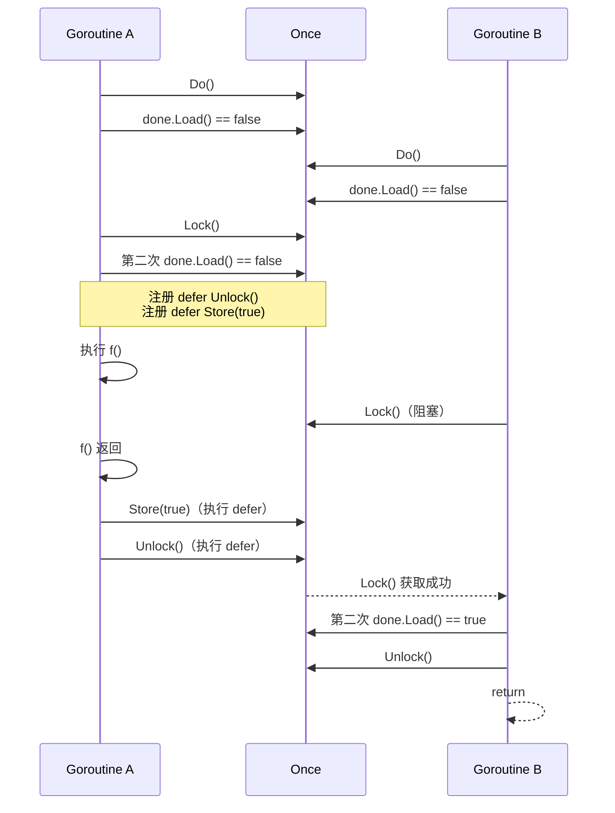

>[!abstract] Go 的 `sync.Once` 用于在并发场景下保证函数只执行一次，并且保证所有 `Do` 调用返回时初始化函数已经执行完成。本文从字段布局、快慢路径、double check、Mutex 等待语义，以及 amd64 下的指令长度优化几个角度解读它的源码实现

## 结构体

```go
package sync
type Once struct {
	_ noCopy

	// done indicates whether the action has been performed.
	// It is first in the struct because it is used in the hot path.
	// The hot path is inlined at every call site.
	// Placing done first allows more compact instructions on some architectures (amd64/386),
	// and fewer instructions (to calculate offset) on other architectures.
	done atomic.Bool
	m    Mutex
}
```

- `_ noCopy`：
  - `noCopy` 是一个空结构体，不占空间，go vet 等工具根据结构体是否存在这个字段来检查这个结构体是否被复制，防止 `Once` 被复制使用，**一般都放在结构体的开头**
- `done atomic.Bool` 依然是第一个字段，处于热路径中（大多数调用都发生在Once已经执行过之后）
  - Once结构体变量的内存地址就是`done`字段的地址，不需要额外计算字段偏移，会被内联到每个调用点
  - 机器指令更短，在某些架构上（amd64/386）可以生成更紧凑的指令，减少计算偏移量的指令，见：[指令长度测试](#指令长度测试)
  - 其他架构上可能少一条偏移计算指令：有些架构访问非零偏移字段时，需要额外计算地址；字段在 offset 0 时可以省掉这一步
- `m Mutex`: 保护 `done` 字段的访问，确保 `Do` 方法的线程安全性，只有在第一次调用 `Do` 时才会使用到锁，之后的调用都直接读取 `done` 字段，不需要加锁 

## 功能实现

> [!tip] 要求
> - 任意一次 `Do` 返回时，那次唯一执行的 `f` 已经执行完成
> - 同一个 `Once` 实例上，`f` 最多只会执行一次

### `Do` 方法的实现

- 如果 `done` 字段为 `false`，说明操作还没有执行过，调用 `doSlow` 方法执行操作
- 如果 `done` 字段为 `true`，说明操作已经执行过，直接返回，不再执行操作，后续所有的访问都不会进入 `doSlow` 方法，避免了锁的开销，是块路径（hot path）

```go
func (o *Once) Do(f func()) {
	if !o.done.Load() {
		o.doSlow(f)
	}
}
```

### `doSlow` 方法的实现

- `doSlow` 方法在第一次调用时会加锁，确保只有一个 goroutine 执行操作，其他 goroutine 会阻塞等待锁释放
- 为什么不能只用CAS（Compare-And-Swap）来实现？
  - CAS 可以保证只有一个 goroutine 执行 `f()`，但不能保证其他 goroutine 等待 `f()` 执行完成
  - 如果第一个 goroutine CAS 成功后开始执行 `f()`，第二个 goroutine CAS 失败后会直接返回，此时 `f()` 可能还没执行完，违反了 `Do` 返回时 `f()` 已经完成的语义
- 为什么需要 `mutex`
  - 确保只有一个 goroutine 执行 `f()`，其他 goroutine 会阻塞，等待获取锁
  - 直到第一个 goroutine 执行完 `f()` 并设置 `done` 字段为 true ，其他 goroutine 才会继续执行，直接返回，不再执行 `f()`
- 为什么 `doSlow` 方法需要再次判断 done字段
  1. 因为可能有多个goroutine访问，然后`f()` <span style="color: red;">执行时间长</span>
  2. 此时两个 goroutine 都通过了 `Do` 方法里的第一次 `done.Load()`，并进入 `doSlow`
  3. 第一个 goroutine 拿到锁并执行 `f()`，第二个 goroutine 阻塞在 `Lock()` 等待锁释放
  4. 第一个 goroutine 执行完之后会设置 `done` 字段为 true 并释放锁
  5. 如果没有第二次判断，第二个 goroutine 拿到锁后会继续执行 `f()`，导致 `f()` 被执行多次

```go
func (o *Once) doSlow(f func()) {
	o.m.Lock()
	defer o.m.Unlock()
	if !o.done.Load() {
		defer o.done.Store(true)
		f()
	}
}
```

double check 的执行时序如下：



第二次 `done.Load()` 必须放在拿到锁之后。因为两个 goroutine 可能同时通过 `Do` 方法里的第一次检查，第二个 goroutine 在等待锁期间，第一个 goroutine 已经执行完 `f()` 并把 `done` 设置为 `true`。如果没有第二次检查，第二个 goroutine 拿到锁后还会继续执行 `f()`。


## 指令长度测试

```go
package main

type First struct {
	done uint32
	m    [8]byte
}

type Second struct {
	m    [8]byte
	done uint32
}

func LoadFirst(p *First) uint32 {
	return p.done
}

func LoadSecond(p *Second) uint32 {
	return p.done
}

```

执行命令：`go build -gcflags='-S' . 2>&1 | rg -n 'TEXT.*Load(First|Second)|MOVL|RET'`

- 可以看到高亮两行的区别：`LoadFirst` 读取 offset 0 的字段，生成 `MOVL (AX), AX`；`LoadSecond` 读取 offset 8 的字段，生成 `MOVL 8(AX), AX`
- 两边指令数量相同，都是 `MOVL` + `RET`，区别在于 `MOVL 8(AX), AX` 把偏移量编码进了同一条指令，所以机器指令更长，但指令长度不同，分别为2和3
- 左侧的 `9`、`10`、`19`、`20` 是 `rg -n` 输出的行号，计算指令长度应该看后面的函数内偏移：`0x0002 - 0x0000 = 2`，`0x0003 - 0x0000 = 3`

```text {hl_lines=[2,5]}
3:	0x0000 00000 (/home/kamiertop/code/to/main.go:13)	  TEXT	  main.LoadFirst(SB), NOSPLIT|NOFRAME|ABIInternal, $0-8
9:	0x0000 00000 (/home/kamiertop/code/to/main.go:14)	  MOVL	  (AX), AX
10:	0x0002 00002 (/home/kamiertop/code/to/main.go:14)	  RET
13:	0x0000 00000 (/home/kamiertop/code/to/main.go:17)	  TEXT	  main.LoadSecond(SB), NOSPLIT|NOFRAME|ABIInternal, $0-8
19:	0x0000 00000 (/home/kamiertop/code/to/main.go:18)	  MOVL	  8(AX), AX
20:	0x0003 00003 (/home/kamiertop/code/to/main.go:18)	  RET
```
