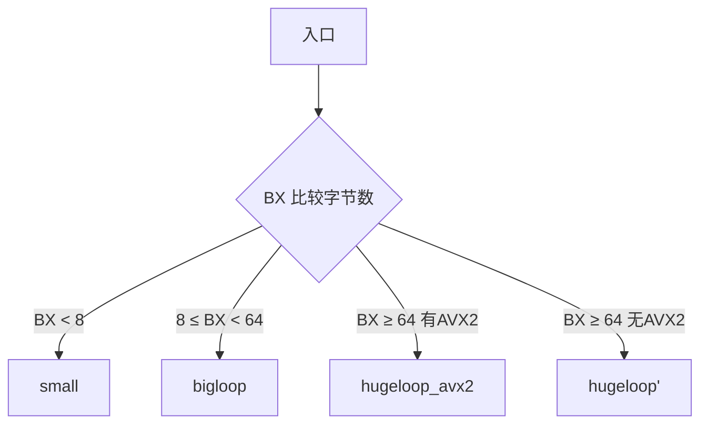

编译期: 识别 `string(a) == string(b)` 是相等比较, 不会分配内存, 直接调用 `runtime.memequal()` 函数比较内存是否相等.

执行期: 利用CPU的SIMD指令, 可以并行比较多个字节(一次性32或64字节), 提高比较效率.

<!--more-->

在读[BadgerDB](https://github.com/dgraph-io/badger)时注意到 `bytes.Equal` 函数的实现, 发现它是直接将两个切片转换为字符串进行比较,
而不是逐字节比较, 注释说编译器会优化这个转换, 不会分配内存, 下面来探索下如何实现的.

函数很简单, 源码如下

```go {name="src/bytes/bytes.go"}
// Equal reports whether a and b
// are the same length and contain the same bytes.
// A nil argument is equivalent to an empty slice.
func Equal(a, b []byte) bool {
	// Neither cmd/compile nor gccgo allocates for these string conversions.
	return string(a) == string(b)
}
```

为了方便使用汇编查看, 将源码实现拷贝下来

```go {name = "bytes.go"}
package main

func Equal(a, b []byte) bool {
	
	return string(a) == string(b)
}
```

使用 `go tool compile -S` 命令查看汇编代码, 为了方便阅读, 只保留核心部分

```asm {hl_lines=[15]}
main.Equal STEXT size=118 args=0x30 locals=0x20 funcid=0x0 align=0x0
    (bytes.go:3)    TEXT    main.Equal(SB), ABIInternal, $32-48 // 声明函数段, $32是栈帧大小(局部变量)
    (bytes.go:3)    CMPQ    SP, 16(R14)                         // 48是入参+返回值总大小, 两个[]byte各24字节, bool8字节
	...
    (bytes.go:3)    FUNCDATA        $6, main.Equal.argliveinfo(SB)
    (bytes.go:3)    PCDATA  $3, $1    
    (bytes.go:5)    CMPQ    BX, SI  // 比较切片的长度
    (bytes.go:5)    JEQ     34
    (bytes.go:5)    XORL    AX, AX  // 长度不等, AX 设为0(false)
    (bytes.go:5)    NOP
    (bytes.go:5)    JMP     45
    (bytes.go:5)    MOVQ    BX, CX  // 将长度存入CX
    (bytes.go:5)    MOVQ    DI, BX  // 将b的指针存储BX (memequal的第2个参数)
    (bytes.go:5)    PCDATA  $1, $1
    (bytes.go:5)    CALL    runtime.memequal(SB)
    ...
```

- 从上面代码可以看到, 编译器十分智能, 分析道只用来比较, 就不会分配内存, 直接将2个切片的指针和长度传入到了`runtime.memequal()`中(通过查看SSA也可以发现)
- 一个切片3个字段, 分别是指针, 长度, 容量, 所以占用3个寄存器
  - 切片a: AX(Data), BX(Len), CX(Cap)
  - 切片b: DI(Data), SI(Len), R8(Cap)
- 所以 `CMPQ    BX, SI` 比较切片长度
- 接下来直接看 `runtime.memequal` 函数

```asm {name="src/internal/bytealg/equal_amd64.s"}
// memequal(a, b unsafe.Pointer, size uintptr) bool
TEXT runtime·memequal<ABIInternal>(SB),NOSPLIT,$0-25
	// AX = a    (want in SI)
	// BX = b    (want in DI)
	// CX = size (want in BX)
	CMPQ	AX, BX	// 比较两个指针的地址
	JNE	neq			// 地址不相等, 跳到 neq 标签
	MOVQ	$1, AX	// 地址相同, 直接把返回值设为1 (true)
	RET				// 返回
neq:
	MOVQ	AX, SI	// 把a的地址从AX挪到SI (挪动寄存器是为了兼容传统的汇编指令集)
	MOVQ	BX, DI	// 把b的地址从BX挪到DI
	MOVQ	CX, BX	// 把size从CX挪到BX
	JMP	memeqbody<>(SB)  // 直接跳转到 memeqbody, 把控制权交给 memeqbody, 不再保留当前的栈帧, 这是"尾调用优化"
```

> [!INFO] 接下来就是 `memeqbody`, 内容比较长, 核心思想是 **分挡位优化**
> 内存比较的字节数越多, 单次读取的字节数越大, 速度越快

- 大小判断
  - <8字节, 跳到small分支
  - <64字节, 跳转到bigloop分支
- 硬件指令判断
  - 支持AVX2: 跳转到hugeloop_avx2分支
  - 不支持AVX2: 跳转到hugeloop分支
- 兜底分支 `leftover`: 处理 `bigloop` 执行完后剩余的 0~8 字节的内存
- 收尾分支 `equal`

```asm
// Input:
//   a in SI
//   b in DI
//   count in BX   // BX是总字节数
// Output:
//   result in AX
TEXT memeqbody<>(SB),NOSPLIT,$0-0  // 不会栈分裂/扩容, 因为没有局部变量, 函数调用
	CMPQ	BX, $8    // BX是长度, 这里比较BX和8
	JB	small		  // BX < 8, 跳转到 small分支
	CMPQ	BX, $64   // 比较BX 和 64
	JB	bigloop		  // BX >= 64, 跳转到 bigloop分支
#ifndef hasAVX2		  // 条件编译, 如果编译时未开启AVX2指令集支持, 先检查当前CPU是否支持AVX2
	CMPB	internal∕cpu·X86+const_offsetX86HasAVX2(SB), $1	// 比较是否支持AVX2, Go 运行时的 CPU 特性检测变量，值为 1 表示 CPU 支持 AVX2
	JE	hugeloop_avx2 // 如果支持AVX2, 跳转到hugeloop_avx2分支

	// 64 bytes at a time using xmm registers
	PCALIGN $16				// 指令对齐, 把下面地址的指令地址对齐到16字节边界, CPU取指更快
hugeloop:					// 不支持AVX2时, 跳转到hugeloop分支
	CMPQ	BX, $64         // 比较BX 和 64
	JB	bigloop				// 剩余<64 → 退出超大循环，跳转到 bigloop 处理剩余的8~63字节
	// 核心: 一次性从2块内存, 读取64字节到8个16位的XMM寄存器
	MOVOU	(SI), X0      // 从a内存[SI]读16字节 → X0
	MOVOU	(DI), X1      // 从b内存[DI]读16字节 → X1
	MOVOU	16(SI), X2    // 从a内存[SI+16]读16字节 → X2
	MOVOU	16(DI), X3    // 从b内存[DI+16]读16字节 → X3
	MOVOU	32(SI), X4    // a[SI+32] → X4
	MOVOU	32(DI), X5    // b[DI+32] → X5
	MOVOU	48(SI), X6    // a[SI+48] → X6
	MOVOU	48(DI), X7    // b[DI+48] → X7
	// 依次对比寄存器的值, 相等的设置为0xff, 不相等的设置为0x00
	PCMPEQB	X1, X0			// 对比X1和X0, 相等的设置为0xff, 不相等的设置为0x00
	PCMPEQB	X3, X2
	PCMPEQB	X5, X4
	PCMPEQB	X7, X6
	// 连续 按位与, 把所有比较结果合并成一个寄存器
	PAND	X2, X0			// X0 = X0 & X2 , 有一个字节不等, 对应的bit位就是0 
	PAND	X6, X4
	PAND	X4, X0
	// 把XMM寄存器的比较结果, 转成32位证书存到DX寄存器
	PMOVMSKB X0, DX
	// 指针偏移+剩余字节数减少, 准备下一轮循环
	ADDQ	$64, SI			// a内存指针向后移动64字节
	ADDQ	$64, DI			// b内存指针向后移动64字节
	SUBQ	$64, BX			// 剩余字节数-64字节
	CMPL	DX, $0xffff		// 比较DX和0xffff
	JEQ	hugeloop			// 相等的话, 继续循环比较下一段
	XORQ	AX, AX			// return 0
	RET
#endif

	// 64 bytes at a time using ymm registers	// 使用 ymm 寄存器, 一次比较64字节
	PCALIGN $16
hugeloop_avx2:
	CMPQ	BX, $64
	JB	bigloop_avx2
	// 一次性读取64字节, 只用4个256位YMM寄存器
	VMOVDQU	(SI), Y0		// a[SI] -> Y0, 一次性读32字节
	VMOVDQU	(DI), Y1
	VMOVDQU	32(SI), Y2
	VMOVDQU	32(DI), Y3
	VPCMPEQB	Y1, Y0, Y4	// Y4 = Y0逐字节比较Y1的掩码
	VPCMPEQB	Y2, Y3, Y5
	VPAND	Y4, Y5, Y6
	VPMOVMSKB Y6, DX
	ADDQ	$64, SI			// a内存指针向后移动64字节
	ADDQ	$64, DI			// b内存指针向后移动64字节
	SUBQ	$64, BX			// 剩余字节数-64字节
	CMPL	DX, $0xffffffff
	JEQ	hugeloop_avx2
	VZEROUPPER				// 清空YMM寄存器
	XORQ	AX, AX	// return 0
	RET

bigloop_avx2:
	VZEROUPPER

	// 8 bytes at a time using 64-bit register
	PCALIGN $16
bigloop:
	CMPQ	BX, $8		
	JBE	leftover
	MOVQ	(SI), CX
	MOVQ	(DI), DX
	ADDQ	$8, SI
	ADDQ	$8, DI
	SUBQ	$8, BX
	CMPQ	CX, DX
	JEQ	bigloop
	XORQ	AX, AX	// return 0
	RET

	// remaining 0-8 bytes	// 一次性读8字节, 值比较其中的最后BX字节, 不用逐字节比较
leftover:
	MOVQ	-8(SI)(BX*1), CX  // 取a内存：SI-8 + BX*1 地址的8字节 → CX
	MOVQ	-8(DI)(BX*1), DX  // 取b内存：DI-8 + BX*1 地址的8字节 → DX
	CMPQ	CX, DX            // 比较这8字节
	SETEQ	AX                // 相等 → AX=1，不等→AX=0
	RET

small:						// 极小内存, 不能直接用8字节指令, 如果内存地址在页边界, 可能越界访问
	CMPQ	BX, $0
	JEQ	equal

	LEAQ	0(BX*8), CX
	NEGQ	CX

	CMPB	SI, $0xf8
	JA	si_high

	// load at SI won't cross a page boundary.
	MOVQ	(SI), SI
	JMP	si_finish
si_high:
	// address ends in 11111xxx. Load up to bytes we want, move to correct position.
	MOVQ	-8(SI)(BX*1), SI
	SHRQ	CX, SI
si_finish:

	// same for DI.
	CMPB	DI, $0xf8
	JA	di_high
	MOVQ	(DI), DI
	JMP	di_finish
di_high:
	MOVQ	-8(DI)(BX*1), DI
	SHRQ	CX, DI
di_finish:

	SUBQ	SI, DI
	SHLQ	CX, DI
equal:
	SETEQ	AX
	RET

```

-----------------




> [!SUCCESS] 没想到简单的相等比较, 底层有这些优化 