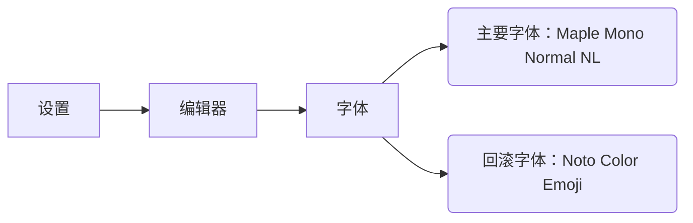

在Fedora44中使用Goland、RustRover等JetBrains IDE时发现无法显示彩色Emoji，并且还需要支持中文，一番折腾找到如下解决办法

```mermaid

flowchart LR

设置 --> 编辑器 --> 字体

字体 --> MapleMono(主要字体：Maple Mono Normal NL)
字体 --> 回滚字体(回滚字体：Noto Color Emoji)

```

---


