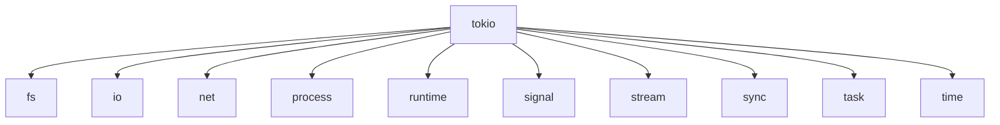
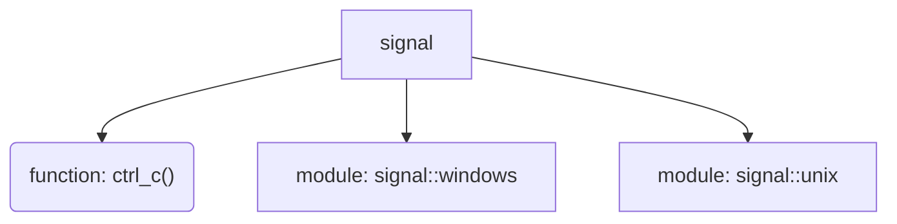

- 在Golang中使用并发非常简单, 通过 `go`关键字即可调用一个函数交由GMP模型调度管理.
- 在Rust中实现并发的模式有很多种, 这里学一下`Tokio`, `Tokio`已经是Rust异步运行时的事实标准了





## `tokio::runtime`

> 在Golang中运行时是内置的, 在Rust中则由第三方来实现, `tokio`中创建运行时有2种方式

### explicit

#### `tokio::runtime::Builder`

> [!SUCCESS]
> 使用Builder的好处是我们可以**精细化的**或者**基于配置的**创建`runtime`

```rust {hl_lines=[11,14,17,20] wrapper=false}
use std::io;
use tokio::runtime::Builder;
use tokio::runtime::Runtime;

fn main() -> io::Result<()> {
    let config = Config {
        thread_name: "my_tokio_thread".to_string(),
        worker_threads: 4,
        // ...
    };
    let mut builder: Builder = Builder::new_multi_thread(); // 先创建一个Builder

    if !config.thread_name.is_empty() {				
        builder.thread_name(config.thread_name);			// 基于配置动态设置Runtime
    }
    if config.worker_threads > 0 {
        builder.worker_threads(config.worker_threads);
    }

    let rt: Runtime = builder.build()?;

    Ok(())
}

struct Config {
    thread_name: String,
    worker_threads: usize,
    // ...
}

```

##### multi_thread

```rust {title="cargo add tokio --features rt-multi-thread" hl_lines=[4]}
use tokio::runtime::Builder;
// multi_thread需要 features: rt-multi-thread
fn main() -> Result<(), std::io::Error> {
    let rt = Builder::new_multi_thread().build()?;
    let _ = rt;
    Ok(())
}
```

##### current_thread

> [!TIP] 上面是一个多线程的, 下面演示一个单线程运行时(类似Golang中的`runtime.GOMAXPROCS(1)`)

```rust {title="cargo add tokio" hl_lines=[4]}
use tokio::runtime::Builder;

fn main() -> Result<(), std::io::Error> {
    let rt = Builder::new_current_thread().build()?;
    let _ = rt;
    Ok(())
}

```


#### `tokio::runtime::Runtime`

> [!NOTE] 使用<u>默认配置</u>创建运行时

```rust {title="需要features: rt-multi-thread"}
use std::io;
use tokio::runtime::Runtime;

fn main() -> io::Result<()> {
    let rt: Runtime = Runtime::new()?;	//  multi threaded scheduler, I/O driver, time

    Ok(())
}

```

### macro

> [!NOTE] 推荐使用宏, 屏蔽了上下文细节, 无需传递Runtime/Handle

#### 单线程版本

`cargo add tokio --features macros rt `

```rust
#[tokio::main(flavor = "current_thread")]
async fn main() {}
```

#### 多线程版本

> [!TIP] 默认是多线程版本, 如果不使用`full`, 需要手动添加: `rt-multi-thread`

`cargo add tokio --features macros rt-multi-thread`

```rust
#[tokio::main(flavor = "multi_thread")]
async fn main() {}
```

等价于

```rust
#[tokio::main]
async fn main() {}
```

#### 使用 `expand` 展开宏来看一下

```rust {hl_lines=["3-8"]}
#[tokio::main(flavor = "multi_thread")]
async fn main() {
    tokio::spawn(async {
        for i in 1..=5 {
            let _ = i;
            tokio::time::sleep(std::time::Duration::from_secs(1)).await;
        }
    });
}
```

- 安装expand工具: `cargo install cargo-expand`
- 展开代码: `cargo expand xxx`

> [!SUCCESS] 展开后的代码如下
> 可以看到上面代码3-8行被放到了下面的`body`变量中, 然后`body`被第26行的`block_on`阻塞等待

```rust {hl_lines=["8-13"]}
#![feature(prelude_import)]
#[macro_use]
extern crate std;
#[prelude_import]
use std::prelude::rust_2024::*;
fn main() {
    let body = async {
        tokio::spawn(async {
            for i in 1..=5 {
                let _ = i;
                tokio::time::sleep(std::time::Duration::from_secs(1)).await;
            }
        });
    };
    #[allow(
        clippy::expect_used,
        clippy::diverging_sub_expression,
        clippy::needless_return,
        clippy::unwrap_in_result
    )]
    {
        return tokio::runtime::Builder::new_multi_thread()
            .enable_all()
            .build()
            .expect("Failed building the Runtime")
            .block_on(body);
    }
}
```

### `tokio::runtime::Handle`

> 一个不拥有运行时, 可以**克隆**, 可以**跨线程传递**的运行时句柄 

#### 在同步函数中启动异步任务

> 我们可以将`handle`传递到同步函数中

```rust {hl_lines=[22]}
use std::time::Duration;
use tokio::runtime::{Handle, Runtime};
use tokio::task::JoinHandle;

fn sync_function(handle: &Handle) -> JoinHandle<()> {
    println!("进入同步函数，准备调度异步任务");

    handle.spawn(async {
        let result = async_task().await;
        println!("[异步任务执行结果]：{}", result);
    })
}

async fn async_task() -> &'static str {
    tokio::time::sleep(Duration::from_millis(100)).await;

    "[ 异步任务完成 ]"
}

fn main() {
    let rt = Runtime::new().unwrap();
    let handle: &Handle = rt.handle();

    // 同步上下文（main 同步代码）中调用同步函数，传递 Handle 调度异步任务
    let handle = sync_function(handle);

    rt.block_on(handle).expect("执行异步任务失败");
}

```

#### 跨线程传递`handle`

```rust {hl_lines=[10]}
use std::thread;
use std::time::Duration;
use tokio::runtime::Builder;
use tokio::time;

fn main() -> Result<(), std::io::Error> {
    let rt = Builder::new_multi_thread().enable_time().build()?;
    let handle = rt.handle().clone();
    let thread_handle = thread::spawn(move || {
        // rt.spawn(async {  }); // 不能在这里使用 runtime 的 spawn 方法，因为 runtime move进来后, 外面就再也无法使用了
        handle.spawn(async {
            time::sleep(Duration::from_secs(1)).await;
            println!(
                "任务在Tokio运行时中执行, 但是定义在另一个线程中, 线程id: {:?}",
                thread::current().id()
            );
        })
    });
    let task_handle = thread_handle.join().unwrap();

    rt.block_on(task_handle)?;

    Ok(())
}

```

#### `Handle::current()`

> 使用宏模式的时候, 通过 `Handle::current()` 获取handle

```rust {hl_lines=[21]}
use std::time::Duration;
use tokio::runtime::Handle;
use tokio::time;

fn sync_function(handle: &Handle) {
    println!("进入同步函数，准备通过 Handle 提交异步任务");
    // 通过 Handle 提交异步任务
    handle.spawn(async {
        let result = async_task().await;
        println!("同步函数提交的任务执行结果：{}", result);
    });
}

async fn async_task() -> &'static str {
    time::sleep(Duration::from_millis(500)).await;
    "[异步任务完成]"
}

#[tokio::main]
async fn main() -> Result<(), std::io::Error> {
    let handle = Handle::current();
    sync_function(&handle);
    time::sleep(Duration::from_secs(1)).await;

    Ok(())
}

```

## `tokio::time`

### 睡眠

> 对于没有VIP的客户我们让他们等一下🤣(不是), 此时可以使用`tokio::time::sleep()`

- 标准库的 `std::thread::sleep()` 会阻塞线程, 而 `tokio::time::sleep()` 则不会阻塞线程, 只会让出线程给其他任务
- 下面代码非常简单, 观察高亮行就能知道如何使用

```rust {hl_lines=[10]}
use std::time::{SystemTime, UNIX_EPOCH};
use tokio::time::Duration;

#[tokio::main]
async fn main() {
    println!(
        "当前时间: {:?}",
        SystemTime::now().duration_since(UNIX_EPOCH)
    );
    tokio::time::sleep(Duration::from_secs(2)).await;
    println!(
        "等待结束，当前时间: {:?}",
        SystemTime::now().duration_since(UNIX_EPOCH)
    );
}
```

### 超时

> [!NOTE] 超时是指任务执行时间超过了指定的时间, 此时会返回一个错误
> - 相对时间: 从当前时间开始计算, 超过指定时间则超时
> - 绝对时间: 指定一个具体的时间点

#### 相对时间

```rust {hl_lines=[10]}
use tokio::time::{Duration, sleep, timeout};

async fn task() {
    // 模拟超时任务
    sleep(Duration::from_secs(3)).await;
}

#[tokio::main]
async fn main() {
    match timeout(Duration::from_secs(2), task()).await {
        Ok(_) => println!("Task completed within timeout"),
        Err(elapsed) => println!("Task timed out, {}", elapsed),
    };
}
```

#### 绝对时间

```rust {hl_lines=[7]}
use std::ops::Add;
use tokio::time::{Duration, Instant, timeout_at};

#[tokio::main]
async fn main() {
    let deadline: Instant = Instant::now().add(Duration::from_secs(2));
    match timeout_at(deadline, do_something()).await {
        Ok(_) => println!("任务完成"),
        Err(_) => println!("任务未在规定时间点之前完成"),
    }
}

async fn do_something() {
    tokio::time::sleep(Duration::from_secs(3)).await;
}

```


### 定时器

> [!TIP] 
> - 第一次 `tick()`是立即完成的, 这很方便, 如果我们不想立刻完成, 可以在循环之前调用一次 `tick()`
> - 定时器返回的 `Instant`总是理论时间, 不会因为任务执行时间而延迟

```rust
use tokio::time::{Duration, interval};

#[tokio::main]
async fn main() {
    let mut ticker = interval(Duration::from_secs(1));
    println!(
        "第一次会立即调用, tick()之前打印时间观察: {:?}",
        tokio::time::Instant::now()
    );
    for i in 0..5 {
        let instant = ticker.tick().await;

        println!("i: {}, instant: {:?}", i, instant);
    }
}

```

可以看到下面输出的第一行和第二行几乎是一样的, 正好印证第一次调用是立即完成的

```text {hl_lines=[1,2] wrapper=false}
第一次会立即调用, tick()之前打印时间观察: Instant { t: 17574.0125039s }
i: 0, instant: Instant { t: 17574.0124982s }
i: 1, instant: Instant { t: 17575.0124982s }
i: 2, instant: Instant { t: 17576.0124982s }
i: 3, instant: Instant { t: 17577.0124982s }
i: 4, instant: Instant { t: 17578.0124982s }
```

## `tokio::sync`

### `tokio::sync::mpsc`

> [!NOTE] 多生产者单消费者异步通道
> `tokio::mpsc`为异步任务通信提供了一个多生产者单消费者通道, 返回一个`Sender`和一个`Receiver`

针对`BoundedChannel`和 `UnboundedChannel`的发送操作返回的错误都是 `tokio::sync::mpsc::SendError`

```rust {wrapper=false, hl_lines=[2,12]}
#[derive(PartialEq, Eq, Clone, Copy)]
pub struct SendError<T>(pub T);

impl<T> fmt::Debug for SendError<T> {
    fn fmt(&self, f: &mut fmt::Formatter<'_>) -> fmt::Result {
        f.debug_struct("SendError").finish_non_exhaustive()
    }
}

impl<T> fmt::Display for SendError<T> {
    fn fmt(&self, fmt: &mut fmt::Formatter<'_>) -> fmt::Result {
        write!(fmt, "channel closed")
    }
}

```

#### Bounded Channel

> [!TIP] 有界通道
> 有界通道是指通道的缓冲区大小是有限的, 当通道满时, 生产者会阻塞, 直到有消费者消费数据

##### Example1

```rust {hl_lines=[5,10,20]}
use tokio::sync::mpsc::{Receiver, Sender, channel};

#[tokio::main]
async fn main() {
    let (tx, mut rx): (Sender<i32>, Receiver<i32>) = channel(10);

    // 发送任务
    tokio::spawn(async move {
        for i in 0..5 {
            if tx.send(i).await.is_err() {
                println!("接收者已关闭");
                return;
            }
            println!("发送任务: {}", i);
        }
    });
    // tx离开此作用域后, 发送者会被关闭, 这会导致接收者收到None

    // 接收任务
    while let Some(task) = rx.recv().await {
        println!("[接收任务]: {}", task);
    }
    
    println!("所有任务已处理完毕");

    println!("再次尝试接收任务: {:?}", rx.recv().await);
}

```

我们来看下输出, 可以看到接收完所有数据后, 再次尝试接收会返回`None`

```text {wrapper=false hl_lines=[12]}
发送任务: 0
发送任务: 1
发送任务: 2
发送任务: 3
发送任务: 4
[接收任务]: 0
[接收任务]: 1
[接收任务]: 2
[接收任务]: 3
[接收任务]: 4
所有任务已处理完毕
再次尝试接收任务: None
```

##### Example2

> [!NOTE]
> 既然是多生产者, 那么我们就可以克隆 `tx` 来创建多个发送者, 查看下面代码
> 需要注意的是, 第28行 `drop(tx)` 是为了关闭通道, 接收者接收完数据后收到`None`, 否则会导致接收者一直阻塞

```rust {hl_lines=[5,6,7,28]}
use tokio::sync::mpsc;

#[tokio::main]
async fn main() {
    let (tx, mut rx) = mpsc::channel(3);
    let tx1 = tx.clone();
    let tx2 = tx.clone();

    tokio::spawn(async move {
        for i in 0..3 {
            if tx1.send(format!("任务1发送: {}", i)).await.is_err() {
                println!("任务1：接收端已关闭，发送失败");
                return;
            }
        }
        println!("任务1：发送完成");
    });

    tokio::spawn(async move {
        for i in 0..3 {
            if tx2.send(format!("任务2发送: {}", i)).await.is_err() {
                println!("任务2：接收端已关闭，发送失败");
                return;
            }
        }
        println!("任务2：发送完成");
    });
    drop(tx);
    while let Some(msg) = rx.recv().await {
        println!("[接收数据]: {}", msg);
    }
}
```

#### Unbounded Channel

> [!TIP] 无界通道
> 无界通道是指通道的缓冲区大小是无限的(可能会导致内存持续增长), `send`操作是同步的, 无需 `.await`

```rust {hl_lines=[5,9]}
use tokio::sync::mpsc::unbounded_channel;

#[tokio::main]
async fn main() {
    let (tx, mut rx) = unbounded_channel::<i32>();

    tokio::spawn(async move {
        for i in 0..5 {
            if tx.send(i).is_err() {
                break;
            }
        }
    });

    while let Some(msg) = rx.recv().await {
        println!("{}", msg);
    }
}

```
> [!NOTE] 同步原语
> `tokio::sync`为异步任务提供了很多同步原语, 熟悉Golang的可能会觉得很亲切 

### `tokio::sync::oneshot`

`oneshot::channel`适用于一次性结果传递/单次通知

> [!NOTE] 单次通知
> `oneshot::channel`创建的通道, 发送端发送数据后, 接收端会收到数据, 然后关闭通道
> `send`方法的函数签名是 `pub fn send(self, value: T) -> Result<(), T>` , 会获取所有权, 所以只能调用一次

```rust {hl_lines=[5,8,13]}
use tokio::sync::oneshot;

#[tokio::main]
async fn main() {
    let (tx, rx) = oneshot::channel::<i32>();

    tokio::spawn(async move {
        if let Err(_) = tx.send(3) {
            println!("the receiver dropped");
        }
    });

    match rx.await {
        Ok(v) => println!("got = {:?}", v),
        Err(_) => println!("the sender dropped"),
    }
}
```
> [!NOTE] 发送端关闭
> sender不发送数据直接drop时, 会关闭通道, 接收端会收到 `RecvError`
> 如果发送前`drop(rx)`, 则发送端会收到 `Result::Err`

```rust
use tokio::sync::oneshot;

#[tokio::main]
async fn main() {
    let (tx, rx) = oneshot::channel::<u32>();

    tokio::spawn(async move {
        drop(tx);
    });

    match rx.await {
        Ok(_) => panic!("This doesn't happen"),
        Err(err) => println!("the sender dropped: {}", err),
    }
}

// the sender dropped: channel closed 
```

### `tokio::sync::broadcast`

> 一个多生产者, 多消费者的广播队列. 每个发送的值, 所有消费者都会收到.

- `drop(tx)` 关闭广播通道, 所有接收任务会收到 `RecvError::Closed` 错误
- Lagged: 当接收方处理速度较慢时，发送方可能会因为缓冲区丢失消息, 接收方会收到 `RecvError::Lagged` 错误，标识接收方落后了多少条消息

> [!NOTE] capacity的真实值可能会大于我们传入的值
> 翻阅源码能发现有一条这样逻辑: `capacity = capacity.next_power_of_two();` // Round to a power of two

#### EasyExample

- <u>如果不等待两个任务，接收任务可能会在主程序退出前完成，因为接收速度较快，消息处理及时，所以能够观察到所有的输出结果.</u>
- <u>如果接收方的处理逻辑较慢，主程序在发送完消息后提前退出，Tokio runtime 被丢弃，这会导致接收任务被中断，从而可能看不到所有的输出消息</u>
 
```rust {hl_lines=[4,5,8,13,22]}
use tokio::sync::broadcast;
#[tokio::main]
async fn main() {
    let (tx, mut rx) = broadcast::channel(5);	// 容量为5
    let mut rx2 = tx.subscribe();	// 创建第二个接收者
	
	// 启动2个异步任务
    let recv_task = tokio::spawn(async move {
        while let Ok(v) = rx.recv().await {
            println!("recv {}", v);	`
        }
    });
    let recv_task2 = tokio::spawn(async move {
        while let Ok(v) = rx2.recv().await {
            println!("recv {}", v);
        }
    });
    for i in 1..=5 {
        if let Ok(recv_num) = tx.send(i) {
            println!("sent value: {}, receiver: {}", i, recv_num);
        }
    }
    drop(tx);	// 关闭广播通道, 接收任务会收到 `RecvError::Closed` 错误，标识通道关闭，进而退出`while`循环
    recv_task.await.unwrap(); // 为了确保所有接收任务能够正确完成并处理完所有消息，建议显式等待接收任务的完成
    recv_task2.await.unwrap();// 使用 await 来保证主程序不会在接收任务完成之前退出
}
```

#### LaggedExample

```rust
use tokio::sync::broadcast;
use tokio::sync::broadcast::error::RecvError;

#[tokio::main]
async fn main() {
    let (tx, mut rx1) = broadcast::channel::<i32>(3);
    let task = tokio::spawn(async move {
        loop {
            match rx1.recv().await {
                Ok(value) => println!("task received: {}", value),
                Err(e) => match e {
                    RecvError::Closed => {
                        println!("task2: channel closed");
                        break;
                    }
                    RecvError::Lagged(count) => {
                        println!("task2: lagged, skipped {} messages", count);
                    }
                },
            }
        }
    });
    for i in 1..=10 {
        if let Ok(recv_num) = tx.send(i) {
            println!("sent value: {}, receiver: {}", i, recv_num);
        }
    }
    drop(tx);
    task.await.unwrap();
}

```

需要注意的是下面的输出顺序并**不是固定**的, 在高亮的两行, 我们可以看到lagged和channel closed.

```text {hl_lines=[12,17] wrapperClass="is-collapsed"}
sent value: 1, receiver: 1
sent value: 2, receiver: 1
sent value: 3, receiver: 1
sent value: 4, receiver: 1
sent value: 5, receiver: 1
sent value: 6, receiver: 1
sent value: 7, receiver: 1
sent value: 8, receiver: 1
sent value: 9, receiver: 1
sent value: 10, receiver: 1
task received: 1
task2: lagged, skipped 5 messages
task received: 7
task received: 8
task received: 9
task received: 10
task2: channel closed
```

## `tokio::signal`



```rust
use std::io;
use tokio::signal;

#[tokio::main]
async fn main() -> io::Result<()> {
    println!("waiting for Ctrl+C signal...");

    signal::ctrl_c().await?;

    println!("Ctrl+C signal received, exiting...");

    Ok(())
}

```

## 收获

> [!SUCCESS] 对 `tokio` 有了大致了解, 也会读API文档了, 后面随着项目使用再更新, 接下来准备读一下调度相关的源码
