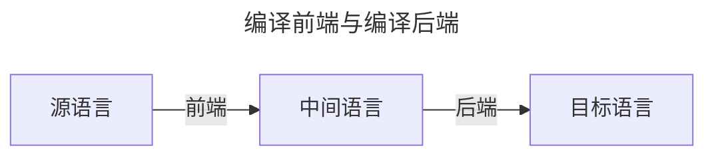

- 什么是编译程序（编译器）：将一种高级语言程序等价地转换成另一种低级语言程序（汇编语言、机器语言）的程序
- 为什么学习编译原理：感兴趣
- 编译程序5个阶段：词法分析，语法分析，中间代码生成，优化，目标代码生成
- 编译前端：与源语言有关，如词法分析，语法分析，语义分析与中间代码生成，与机器无关的优化
- 编译后端：与目标机器有关，与目标机器有关的优化，目标代码生成

```mermaid
---
title: 编译前端与编译后端
---
graph LR;
    源语言 -- 前端 --> 中间语言
    中间语言 -- 后端 --> 目标语言
```
