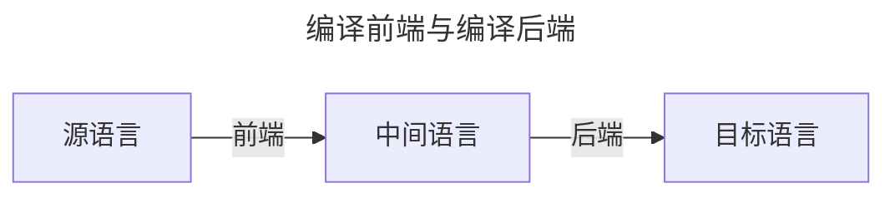





## 引论

- 什么是编译程序（编译器）：将一种高级语言程序等价地转换成另一种低级语言程序（汇编语言、机器语言）的程序
- 为什么学习编译原理：感兴趣
- 编译程序5个阶段：词法分析，语法分析，中间代码生成，优化，目标代码生成
- 编译前端：与源语言有关，如词法分析，语法分析，语义分析与中间代码生成，与机器无关的优化
- 编译后端：与目标机器有关，与目标机器有关的优化，目标代码生成



## 高级程序设计语言概述


本章较为简单, 简单记录下




- 标识符是语法概念, 名字是语义概念
- 程序语言定义包含<u>语法</u>和<u>语义</u>
  - 语法: 一组规则, 用它可以形成和产生一个合式的程序
    - 词法规则: 单词符号的形成规则, 一般包括常数,标识符,基本字,算符等
    - 使用**有限自动机**描述
  - 语义: 语法单位的形成规则, 可以定义一个程序的意义
    - 语法单位通常包括: 标傲世,语句, 过程, 函数, 程序等
    - 使用**上下文无关文法**描述
- 最近嵌套原则

  ```go
  func main(){
      var x int = 1
      {
          println(x) // 可以访问外部作用域的x
          var y int = 1
          x = 10    // 还可以修改x
      }
    // println(y) 无法访问
    println(x) // 10
  }
  ```

- 数据类型三要素
  - 用于区别这种类型数据对象的属性
  - 这种类型的数据对象可以具有的值
  - 可以作用域这种类型的数据对象的操作
- 抽象数据类型包括
  - 数据对象集合
  - 作用于这些数据对象的抽象运算的几何
  - 这种类型对象的封装
- 表达式由运算符(也称操作数, 即数据引用或函数调用)和算符(运算符,操作符)组成. (Rust就是一门基于表达式的语言)
  - 中缀: X-Y
  - 前缀: -A
  - 后缀: p->
- 表达式形成规则(表达式是一个值)
  - 变量和常数是表达式
  - 若E1和E2是表达式, α是一个运算符, 则E1αE2是表达式
  - 若E是表达式,α是一元算符, 则αE或Eα是表达式
  - 若E是表达式,则(E)是表达式
- 表达式计算规定即算符的优先次序
- 赋值语句
  - A := B (将B的右值赋值给A的左值)
  - 名字的**左值**: 该名字代表的存储单元的地址
  - 名字的**右值**: 该名字代表的存储单元的内容
- 控制语句
  - 无条件转移语句: `goto`
  - 条件语句: `if else`
  - 循环语句: `while`, `for`, `loop`
  - 过程调用语句
  - 返回语句: `return`



## 高级程序设计语言的语法描述



- 文法: 描述语言的语法结构的形式规则
- 定义文法的目的是描述语言. 一个符号怎么替换, 都和它周围的符号没有关系. 是一套规则集合, 用来描述一类语言的结构
- 字母表: 一个有穷字符集, 字母表中每个元素成为字符
- 上下文无关文法: G是一个四元组$G=(V_T,V_N,S,P)$
  - $V_T$: 终结符集合(非空), **不能再拆分的'最小单位'**
  - $V_N$: 非终结符集合(非空), 且$V_T ∩ V_N = \emptyset$, 可以被替换的'占位符'
  - S: 文法的开始符号, 是一个特殊的非终结符, 至少必须在某个产生式左部出现一次
  - P: 产生式集合(有限)
- 通俗易懂解释(感谢豆包大人)
  - 产生式的左边只能有一个非终结符, 而且这个非终结符的替换规则, 和它左右是什么符号没有关系. 比如主语->猫, 那么不管主语出现在句子的什么位置, 都可以换成猫
  - 直观展示
    1. 起点: 句子
    2. 应用规则(句子由主语+谓语组成): 句子->主语+谓语
    3. 应用规则(这里的主语是猫): 主语->猫 -> 猫+谓语
    4. 应用规则: 谓语->吃+鱼 -> 猫+吃+鱼
    5. 现在所有符号都是终结符(猫,吃,鱼), 最终得到合法句子: 猫吃鱼
  - 以Python为例
    1. 非终结符: 赋值语句, 变量, 表达式
    2. 终结符: =,x,5,+
    3. 产生式: 赋值语句->`变量=表达式`; 变量->x, 表达式->5
    4. 推导: `赋值语句->变量=表达式` -> `x=5` -> 合法的Python语句 `x=5`
- 上下文无关文法约定: P->a1,P->a2,...P->an; 可缩写为 P->a1|a2|a3|...|an, 其中ai为P的一个候选式
- 推导: α1=>α2=>α3=>...=>αn,那么称这个序列是从α1到αn的一个**推导**
  - α1 $\stackrel{*}{\Rightarrow}$ αn: 从α1出发, 经过0步或若干步推出
  - α1 $\stackrel{+}{\Rightarrow}$ αn: 从α1出发, 经过1步或若干步推出
- 假定G是一个文法, S是G的开始符号. 如果S $\stackrel{*}{\Rightarrow}$ α, 则称α是一个**句型**
- 只含有终结符号的句型是一个**句子**
- 文法G所产生的句子的全体是一个**语言**, 记为L(G)
- 最左推导和最后推导: 先替换最左或者最右
- 语法树: 用一张图表示一个句型的推导, 称为**语法树**
  - E(E) -> i | E+E | E\*E | (E)
  - (i\*i+i)

  ```mermaid
  graph TD
    L1[E] --> L21["("]
    L1[E] --> L22[E]
    L1[E] --> L23[")"]
    L22   --> L31[E]
    L22   --> L32[+]
    L22   --> L33[E]
    L31   --> L41[E]
    L31   --> L42[*]
    L31   --> L43[E]
    L33   --> L44[i]
    L41   --> L51[i]
    L43   --> L52[i]
  ```

- 文法的二义性: 如果一个文法存在某个句子对应两颗不同的语法树, 则说这个文法是二义的
- 语言的二义性来自于语言本身, 和文法无关, 二义性问题是不可判定问题
- 形式语言分为0,1,2,3型, 0型 包含 1型 包含 2型 包含 3型



## 词法分析

- 词法分析器的结构：输入缓冲区 -> 预处理子程序(剔除无用的空白跳格、回车，区分标号区、连接续行和给出句末符等) -> 扫描缓冲区 -> 扫描器 -> 单词符号
- 扫描缓冲区：使用起点指示器和搜索指示器
  - 将缓冲区分为两个半区， 两个半区互补使用
- 单词符号的识别：超前搜索
  - 关键字识别
    - 以Fortran语言的DO关键字为例：`DO99K=1,10 -> DO 99 k = 1, 1=`；`DO99k=1.0`，只有<u>超前扫描</u>到`,和.`才能知道是干嘛的
  - 标识符识别：字母开头的字母数字串，后跟界符或算符
  - 常数识别：识别出算数常数并将其转变为二进制内码表示
  - 算符和界符的识别
- 几点限制——不必使用超前搜索（可读性强，词法分析方便）
  - **所有关键字都是保留字**
  - **关键字作为特殊的标识符来处理**，使用保留字表
  - 如果关键字（基本字）、标识符和常数之间没有确定的运算符或界符作间隔，则必须**使用一个空白符做间隔**
- 状态转换图：一张有限方向图
  - 只包含有限个状态，其中一个为**初态**，至少要有一个终态
- 一个简单的词法分析程序，由Golang实现，Copilot给出了一个极简的代码用于学习

```golang
package main

import (
	"fmt"
	"unicode"
)

type Token struct {
	Kind string
	Lit  string
}

const (
	Reset = "\033[0m"
	Red   = "\033[31m"
	Blue  = "\033[34m"
)

func RedString(str string) string {
	return Red + str + Reset
}

func BlueString(str string) string {
	return Blue + str + Reset
}

var keywords = map[string]string{
	"package": "KW_PACKAGE",
	"func":    "KW_FUNC",
	"var":     "KW_VAR",
	"return":  "KW_RETURN",
	"int":     "KW_TYPE_INT",
	"println": "KW_BUILTIN_FUNC",
	"main":    "KW_MAIN",
}

func main() {
	srcCode := `
package main

func main() {
	var a int = 10
	println(a)
}
`
	println(srcCode)
	tokens := Lex(srcCode)
	for _, tok := range tokens {
		fmt.Printf("Kind: %-15s Lit: %s\n", tok.Kind, tok.Lit)
	}
}

func Lex(src string) []Token {
	var tokens []Token
	r := []rune(src)
	for i, n := 0, len(r); i < n; {
		ch := r[i]
		// whitespace
		if unicode.IsSpace(ch) {
			if ch == '\n' {
				tokens = append(tokens, Token{Kind: "NEWLINE", Lit: "\n"})
			}
			i++
			continue
		}
		// identifier / keyword
		if unicode.IsLetter(ch) {
			j := i + 1
			for j < n {
				if unicode.IsLetter(r[j]) || unicode.IsDigit(r[j]) {
					j++
				} else {
					break
				}
			}
			lit := string(r[i:j])
			if tokenType, ok := keywords[lit]; ok {
				tokens = append(tokens, Token{Kind: RedString(tokenType), Lit: BlueString(lit)})
			} else {
				tokens = append(tokens, Token{Kind: "IDENTIFIER", Lit: lit})
			}
			// update i
			i = j
			continue
		}
		// number literal
		if unicode.IsDigit(ch) {
			j := i + 1
			for j < n && unicode.IsDigit(r[j]) {
				j++
			}
			tokens = append(tokens, Token{Kind: "NUMBER", Lit: string(r[i:j])})
			i = j
			continue
		}
		if ch == ':' && i+1 < n && r[i+1] == '=' {
			tokens = append(tokens, Token{Kind: "OP_ASSIGN", Lit: ":="})
			i += 2
			continue
		}
		// string literal
		if ch == '"' {
			j := i + 1
			for j < n && r[j] != '"' {
				if r[j] == '\\' && j+1 < n {
					j += 2
				} else {
					j++
				}
			}
			if j < n && r[j] == '"' {
				j++
			}
			tokens = append(tokens, Token{"STRING", string(r[i:j])})
			i = j
			continue
		}
		// single char symbol
		tokens = append(tokens, Token{"SingleCharacterSymbol", string(ch)})
		i++
	}

	return append(tokens, Token{Kind: "EOF", Lit: ""})
}

```

```text

package main

func main() {
        var a int = 10
        println(a)
}

Kind: NEWLINE         Lit:

Kind: KW_PACKAGE Lit: package
Kind: KW_MAIN Lit: main
Kind: NEWLINE         Lit:

Kind: NEWLINE         Lit:

Kind: KW_FUNC Lit: func
Kind: KW_MAIN Lit: main
Kind: SingleCharacterSymbol Lit: (
Kind: SingleCharacterSymbol Lit: )
Kind: SingleCharacterSymbol Lit: {
Kind: NEWLINE         Lit:

Kind: KW_VAR Lit: var
Kind: IDENTIFIER      Lit: a
Kind: KW_TYPE_INT Lit: int
Kind: SingleCharacterSymbol Lit: =
Kind: NUMBER          Lit: 10
Kind: NEWLINE         Lit:

Kind: KW_BUILTIN_FUNC Lit: println
Kind: SingleCharacterSymbol Lit: (
Kind: IDENTIFIER      Lit: a
Kind: SingleCharacterSymbol Lit: )
Kind: NEWLINE         Lit:

Kind: SingleCharacterSymbol Lit: }
Kind: NEWLINE         Lit:

Kind: EOF             Lit:

```

## 语法分析

## 属性文法和语法制导翻译

## 语义分析和中间代码生成

## 符号表

## 优化

## 目标代码生成
