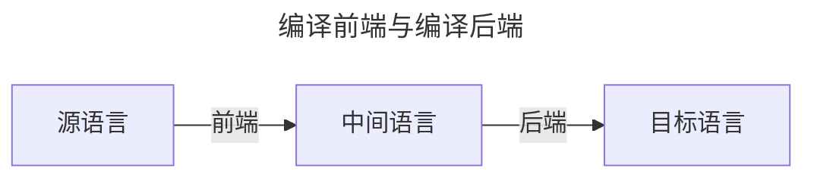





## 引论

- 什么是编译程序（编译器）：将一种高级语言程序等价地转换成另一种低级语言程序（汇编语言、机器语言）的程序
- 为什么学习编译原理：感兴趣
- 编译程序5个阶段：词法分析，语法分析，中间代码生成，优化，目标代码生成
- 编译前端：与源语言有关，如词法分析，语法分析，语义分析与中间代码生成，与机器无关的优化
- 编译后端：与目标机器有关，与目标机器有关的优化，目标代码生成



## 高级程序设计语言概述


本章较为简单, 简单记录下




- 标识符是语法概念, 名字是语义概念
- 程序语言定义包含<u>语法</u>和<u>语义</u>
  - 语法: 一组规则, 用它可以形成和产生一个合式的程序
    - 词法规则: 单词符号的形成规则, 一般包括常数,标识符,基本字,算符等
    - 使用**有限自动机**描述
  - 语义: 语法单位的形成规则, 可以定义一个程序的意义
    - 语法单位通常包括: 标傲世,语句, 过程, 函数, 程序等
    - 使用**上下文无关文法**描述
- 最近嵌套原则

  ```go
  func main(){
      var x int = 1
      {
          println(x) // 可以访问外部作用域的x
          var y int = 1
          x = 10    // 还可以修改x
      }
    // println(y) 无法访问
    println(x) // 10
  }
  ```

- 数据类型三要素
  - 用于区别这种类型数据对象的属性
  - 这种类型的数据对象可以具有的值
  - 可以作用域这种类型的数据对象的操作
- 抽象数据类型包括
  - 数据对象集合
  - 作用于这些数据对象的抽象运算的几何
  - 这种类型对象的封装
- 表达式由运算符(也称操作数, 即数据引用或函数调用)和算符(运算符,操作符)组成. (Rust就是一门基于表达式的语言)
  - 中缀: X-Y
  - 前缀: -A
  - 后缀: p->
- 表达式形成规则(表达式是一个值)
  - 变量和常数是表达式
  - 若E1和E2是表达式, α是一个运算符, 则E1αE2是表达式
  - 若E是表达式,α是一元算符, 则αE或Eα是表达式
  - 若E是表达式,则(E)是表达式
- 表达式计算规定即算符的优先次序
- 赋值语句
  - A := B (将B的右值赋值给A的左值)
  - 名字的**左值**: 该名字代表的存储单元的地址
  - 名字的**右值**: 该名字代表的存储单元的内容
- 控制语句
  - 无条件转移语句: `goto`
  - 条件语句: `if else`
  - 循环语句: `while`, `for`, `loop`
  - 过程调用语句
  - 返回语句: `return`



## 高级程序设计语言的语法描述

## 词法分析

## 语法分析

## 属性文法和语法制导翻译

## 语义分析和中间代码生成

## 符号表

## 优化

## 目标代码生成
