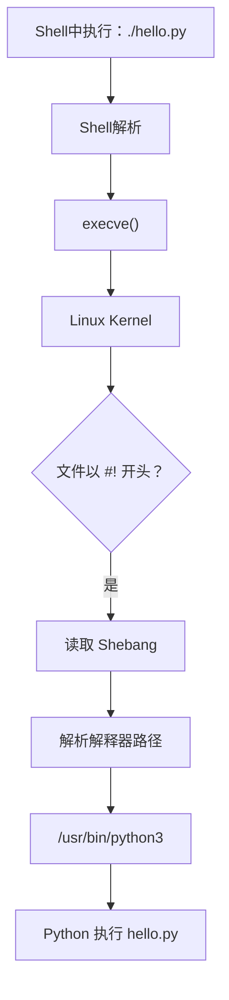

>[!summary] 前言
> - 在做CTF时使用了一个 `git-dumper` 工具，通过 `pip install git-dumper` 安装好之后，就可以直接使用：`git-dumper http://example.com/.git/ ./output` 
> - 我想到 pip install 的工具一般是库或者脚本，而不是可执行文件，为什么可以直接运行呢？后来才知道是因为 `git-dumper` 的第一行是 Shebang: `#!/usr/bin/python3`，Linux内核会解析这个指令，然后调用 `/usr/bin/python3` 来执行这个脚本。

Shebang别名Hashbang

## 常见形式

- `#!/bin/bash`：使用bash解释器执行脚本
- `#!/usr/bin/env python3`：使用系统环境中的python3解释器执行，方便在虚拟环境中使用
- `#!/usr/bin/perl`：使用perl解释器执行脚本
- `#!/usr/bin/python3`：使用指定的python3解释器执行脚本

## 为什么脚本需要`Shebang`

方便用户直接运行脚本，而不需要手动指定解释器。对于我当前的使用场景来说，使用 pip 安装一个工具然后就可以直接使用了，非常方便。

## Shebang如何使用

在脚本的第一行添加 Shebang，例如 `#!/usr/bin/python3`，然后给脚本添加执行权限，就可以直接运行脚本了。

### 示例1
> 使用Python解释器来执行脚本，现在的Linux发行版一般都自带Python3解释器，所以可以直接使用Python3来执行脚本
```python3 {title="hello"}
#!/usr/bin/python3
print("Hello, World!")
```

赋予权限：`chmod +x hello`
执行：`./hello`

>[!tip] 这个文件名也可以是 hello.py，然后 `./hello.py`，Linux不会关心文件的后缀名

### 示例2
> 下面是我之前最常见的使用场景，使用 bash 脚本来执行一些命令
```bash {title="hello.sh"}
#!/bin/bash
echo "Hello, World!"
```

赋予权限：`chmod +x hello.sh`
执行：`./hello.sh`

## Shebang的工作原理



- shell 通过 `execve()` 系统调用请求内核执行 `hello.py` 文件，内核发现这是一个Shebang脚本，根据Shebang找到解释器
- 使用 strace 命令可以查看系统调用的过程：`strace ./hello.py`

## Shebang中的 env

>[!important] `#!/usr/bin/env python3` 是一种更灵活的方式，它会在系统的环境变量中查找 `python3` 的路径，而不是固定使用 `/usr/bin/python3`。这对于使用虚拟环境（virtualenv）非常有用，因为虚拟环境中的 Python 解释器可能不在 `/usr/bin/` 下。

### `#!/usr/bin/env python3`

```python3 {title="hello"}
#!/usr/bin/env python3

import sys

print("Python version:", sys.version)

print("Python executable:", sys.executable)

```

- `./hello` 输出：
    ```text
    Python version: 3.14.6 (main, Jun 11 2026, 00:00:00) [GCC 16.1.1 20260515 (Red Hat 16.1.1-2)]
    Python executable: /usr/bin/python3
    ```
- `source ./venv/bin/activate` 激活虚拟环境后，`./hello` 输出：
    ```text
    Python version: 3.12.13 (main, May  4 2026, 21:09:48) [Clang 22.1.3 ]
    Python executable: /home/kamiertop/code/ctf/.venv/bin/python3
    ```
  - 可以看到是用的是当前环境中的Python解释器

### `#!/usr/bin/python3`

>[!info] 直接使用固定路径的解释器