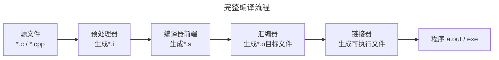

接触编程很长时间了, 但很惭愧在这方面了解的比较少, 偶然在群里看到有大佬在讨论相关技术, 于是找到这本书来学一下

## 编译和链接

编译原理在本科是一门选修课, 当时认知很低, 没有好好学, 现在越发感兴趣, 于是来学一下

之前工作时使用Golang, 自己也学过一些Rust, 虽然它们都是编译型语言，但是对于其中的过程并不是那么清楚了解，
书中以c/cpp为例进行讲解(当时还没有Go和Rust哈哈), 接下来跟着书来学下, 读完这本书准备去系统学一下编译原理, 做个小的编译器




### 预处理

> 预处理过程主要处理那些源代码文件中以"`#`"开始的预编译指令, 比如 `#include`,`#define`, 删除所有注释等等, 详细的处理流程可自行检索

这里给出两个demo

#### 删除所有`#define`, 展开宏定义

使用gcc和-E参数: `gcc -E hello.c -o hello.i`, 输出如下, 可以看到所有的宏都被替换了, 注释也被删除了



```c {title="hello.c" hl_lines=[1,2,3]}
#define PI 3.1415926
#define RADIUS 5
#define AREA (PI * RADIUS * RADIUS)

// 这是一个注释
int main() {
    double area = AREA;

    return 0;
}
```

===

```c {title="hello.i" data-open=true hl_lines=13}
# 0 "hello.c"
# 0 "<built-in>"
# 0 "<command-line>"
# 1 "/usr/include/stdc-predef.h" 1 3 4
# 0 "<command-line>" 2
# 1 "hello.c"


int main() {
    double area = (3.1415926 * 5 * 5);

    return 0;
}

```



#### 注入#include中的内容

准备一个`simple.h`头文件

```c {title="simple.h"}
int add(int x, int y)
{
    return x + y;
}
```

使用`gcc -E hello.c -o hello.i`,可以看到预处理后的文件, 并且`simple.h`中的内容确实被复制了两行(参看高亮部分)



```c {title="hello.c" hl_lines=[2]}
#include "simple.h"
#include "simple.h" // 重复包含，预处理会把 simple.h 的内容复制两次

int main(void) {
    int d = add(3, 4);
    (void)d;
    return 0;
}
```

===

```c {title="hello.i" hl_lines=[8,14]}
# 0 "hello.c"
# 0 "<built-in>"
# 0 "<command-line>"
# 1 "/usr/include/stdc-predef.h" 1 3 4
# 0 "<command-line>" 2
# 1 "hello.c"
# 1 "simple.h" 1
int add(int x, int y)
{
    return x + y;
}
# 2 "hello.c" 2
# 1 "simple.h" 1
int add(int x, int y)
{
    return x + y;
}
# 3 "hello.c" 2

int main(void) {
    int d = add(3, 4);
    (void)d;
    return 0;
}

```



### 编译

> 编译过程是将预处理完的文件进行词法分析，语法分析，语义分析等，优化后生成对应的汇编文件

```c {title="hello.c"}
#include <stdio.h>

int main(void) {
    printf("Hello, World!\n");
    return 0;
}
```

编译为汇编代码：`gcc -S hello.c -o hello.s`，上述内容被编译为下面的汇编代码

```gas {title="hello.s"}
.file	"hello.c"
	.text
	.section	.rodata
.LC0:
	.string	"Hello, World!"
	.text
	.globl	main
	.type	main, @function
main:
.LFB0:
	.cfi_startproc
	endbr64
	pushq	%rbp
	.cfi_def_cfa_offset 16
	.cfi_offset 6, -16
	movq	%rsp, %rbp
	.cfi_def_cfa_register 6
	leaq	.LC0(%rip), %rax
	movq	%rax, %rdi
	call	puts@PLT
	movl	$0, %eax
	popq	%rbp
	.cfi_def_cfa 7, 8
	ret
	.cfi_endproc
.LFE0:
	.size	main, .-main
	.ident	"GCC: (Ubuntu 11.4.0-1ubuntu1~22.04.2) 11.4.0"
	.section	.note.GNU-stack,"",@progbits
	.section	.note.gnu.property,"a"
	.align 8
	.long	1f - 0f
	.long	4f - 1f
	.long	5
0:
	.string	"GNU"
1:
	.align 8
	.long	0xc0000002
	.long	3f - 2f
2:
	.long	0x3
3:
	.align 8
4:

```

### 汇编

> 汇编器将汇编代码变成机器可以执行的指令，汇编过程主要是根据汇编指令和机器指令的对应关系，将汇编代码转换为目标文件（通常是二进制格式，如ELF、COFF等）

在上一节已经得到了编译后的汇编代码，现在用汇编器进行汇编输出目标文件：`as hello.s -o hello.o`，得到目标文件：`hello.o`

### 链接

> 将一个或多个目标文件以及库函数链接为一个可执行文件
>
> 1. 符号解析
> 2. 地址分配
> 3. 重定位
> 4. 合并代码和数据
> 5. 静态链接、动态链接
> 6. 符号冲突和重定义
> 7. 生成可执行文件或库

```bash {title="使用ld手动静态链接"}
/usr/bin/ld -static -o hello_static_ld \
  /usr/lib/x86_64-linux-gnu/crt1.o \
  /usr/lib/x86_64-linux-gnu/crti.o \
  /usr/lib/gcc/x86_64-linux-gnu/11/crtbeginT.o \
  hello.o \
  -L/usr/lib/gcc/x86_64-linux-gnu/11 \
  -L/usr/lib/x86_64-linux-gnu \
  --start-group -lc -lgcc -lgcc_eh --end-group \
  /usr/lib/gcc/x86_64-linux-gnu/11/crtend.o \
  /usr/lib/x86_64-linux-gnu/crtn.o

./hello_static_ld
```

gcc其实是上面那些命令的封装，通过不同的参数调用不同的命令

## 目标文件里有什么

目标文件（Object File）是编译器、汇编器对源代码编译后生成的中间文件，包含机器指令、数据、符号表、重定位信息等，是链接器最终生成可执行文件或共享库的核心输入

### 作用

- 模块化编译：允许将一个大型程序拆分成多个源代码文件进行独立编译。每个源文件编译后都会生成一个对应的目标文件
- 链接输入：是链接器的主要输入，链接器将多个目标文件、库我呢见组合起来，解析它们之间的相互引用（函数调用、全局变量访问），最终生成完整的可执行程序
- 重定位信息：包含地址占位符和重定位记录，允许链接器在最终程序中为代码和数据分配实际的内存地址


### 目标文件格式

#### ELF(Executable and Linkable Format)

> [!NOTE] 目标文件、可执行文件和共享库 (动态库) 都遵循相同的底层文件格式规范(ELF,PE,Mach-O)

- 文件扩展名通常是 `.o`，共项目是 `.so`
- 引用范围：几乎所有的类Unix系统
- 主要特点
  - 模块化和灵活性强：很灵活，可以用于目标文件（未链接）、可执行文件和共享库
  - 段：清晰的划分了`.text`,`.data`,`.bss`
  - 程序头（Program Header）：包含加载器所需的信息，用于描述程序如何被加载到内存中执行

#### PE(Protable Executable)

- 应用范围：Windows
- 文件扩展名：通常是`.obj`，动态链接库是`.dll`，可执行文件是`.exe`
- 主要特点
  - 基于COFF
  - 相对虚拟地址：文件加载更灵活
  - 导入导出表：有专门的表格处理动态链接

#### Mach-O(Mach Object)

- 应用范围：苹果系统
- 文件扩展名：目标文件通常是 `.o`，动态库是 `.dylib`，可执行文件没有特定扩展名
- 主要特点
  - Sedment/Section结构：结构上类似于ELF，但使用了不同的术语和组织方式
  - Universal Binaries（通用二进制）：允许将针对多个CPU架构的代码段打包进同一个可执行文件或库中，方便分发

### ELF格式

网上搜到一篇讲解ELF格式的，就不去翻文档了

[ELF文件结构与分析](https://rqdmap.top/posts/elf-structure/)

```c {title=sample.c}
// 外部符号：未定义符号，用来触发重定位
extern int ext_func(int);

// 全局变量：data 段
int global_var = 42;

// 未初始化变量：bss 段
int uninit_var;

// 只读常量：rodata 段
const char* message = "Hello ELF";

const char* message2 = "The second read only data";

// 本地静态变量：只在此文件可见，local symbol
static int local_static = 99;

// 正常函数：进入 .text
int my_add(int a, int b) {
    return a + b + global_var + local_static;
}

// 调用外部函数：触发 .rela.text 重定位
int call_ext() {
    return ext_func(global_var);
}
```

`gcc -c sample.c`

使用file命令查看文件格式

```bash {title="file sample.o"}
# 可以看到下面输出中有：relocatable, 说明这是一个可重定位目标文件
sample.o: ELF 64-bit LSB relocatable, x86-64, version 1 (SYSV), not stripped
```

#### Header

```bash {title="readelf -h sample.o"}
ELF Header:
  Magic:   7f 45 4c 46 02 01 01 00 00 00 00 00 00 00 00 00
  Class:                             ELF64
  Data:                              2's complement, little endian
  Version:                           1 (current)
  OS/ABI:                            UNIX - System V
  ABI Version:                       0
  Type:                              REL (Relocatable file)
  Machine:                           Advanced Micro Devices X86-64
  Version:                           0x1
  Entry point address:               0x0
  Start of program headers:          0 (bytes into file)
  Start of section headers:          1096 (bytes into file)
  Flags:                             0x0
  Size of this header:               64 (bytes)
  Size of program headers:           0 (bytes)
  Number of program headers:         0
  Size of section headers:           64 (bytes)
  Number of section headers:         16
  Section header string table index: 15
```

#### 查看Section

```bash {title="readelf -S sample.o"}
# 使用readelf命令，结合 -S查看节表sections，可以看到 .text, .rela.text, .data, .bss等
# 并且能看到每个section的地址对齐，文件偏移，大小，类型（PROGBITS，RELA，PROGBITS，NOBITS等）
There are 16 section headers, starting at offset 0x448:

Section Headers:
  [Nr] Name              Type             Address           Offset
       Size              EntSize          Flags  Link  Info  Align
  [ 0]                   NULL             0000000000000000  00000000
       0000000000000000  0000000000000000           0     0     0
  [ 1] .text             PROGBITS         0000000000000000  00000040
       000000000000003f  0000000000000000  AX       0     0     1
  [ 2] .rela.text        RELA             0000000000000000  000002f8
       0000000000000060  0000000000000018   I      13     1     8
  [ 3] .data             PROGBITS         0000000000000000  00000080
       0000000000000008  0000000000000000  WA       0     0     4
  [ 4] .bss              NOBITS           0000000000000000  00000088
       0000000000000004  0000000000000000  WA       0     0     4
  [ 5] .rodata           PROGBITS         0000000000000000  00000088
       0000000000000024  0000000000000000   A       0     0     1
  [ 6] .data.rel.local   PROGBITS         0000000000000000  000000b0
       0000000000000010  0000000000000000  WA       0     0     8
  [ 7] .rela.data.r[...] RELA             0000000000000000  00000358
       0000000000000030  0000000000000018   I      13     6     8
  [ 8] .comment          PROGBITS         0000000000000000  000000c0
       000000000000002e  0000000000000001  MS       0     0     1
  [ 9] .note.GNU-stack   PROGBITS         0000000000000000  000000ee
       0000000000000000  0000000000000000           0     0     1
  [10] .note.gnu.pr[...] NOTE             0000000000000000  000000f0
       0000000000000020  0000000000000000   A       0     0     8
  [11] .eh_frame         PROGBITS         0000000000000000  00000110
       0000000000000058  0000000000000000   A       0     0     8
  [12] .rela.eh_frame    RELA             0000000000000000  00000388
       0000000000000030  0000000000000018   I      13    11     8
  [13] .symtab           SYMTAB           0000000000000000  00000168
       0000000000000138  0000000000000018          14     6     8
  [14] .strtab           STRTAB           0000000000000000  000002a0
       0000000000000057  0000000000000000           0     0     1
  [15] .shstrtab         STRTAB           0000000000000000  000003b8
       0000000000000089  0000000000000000           0     0     1
Key to Flags:
  W (write), A (alloc), X (execute), M (merge), S (strings), I (info),
  L (link order), O (extra OS processing required), G (group), T (TLS),
  C (compressed), x (unknown), o (OS specific), E (exclude),
  D (mbind), l (large), p (processor specific)
```

##### 查看符号表

```bash {title="readelf -s sample.o"}
# 查看符号表，在最右边那一列看到了我们上面C代码中自己定义的：global_var,local_static,my_add,call_ext等以及他们的类型
Symbol table '.symtab' contains 13 entries:
   Num:    Value          Size Type    Bind   Vis      Ndx Name
     0: 0000000000000000     0 NOTYPE  LOCAL  DEFAULT  UND
     1: 0000000000000000     0 FILE    LOCAL  DEFAULT  ABS sample.c
     2: 0000000000000000     0 SECTION LOCAL  DEFAULT    1 .text
     3: 0000000000000000     0 SECTION LOCAL  DEFAULT    3 .data
     4: 0000000000000000     0 SECTION LOCAL  DEFAULT    5 .rodata
     5: 0000000000000004     4 OBJECT  LOCAL  DEFAULT    3 local_static
     6: 0000000000000000     4 OBJECT  GLOBAL DEFAULT    3 global_var
     7: 0000000000000000     4 OBJECT  GLOBAL DEFAULT    4 uninit_var
     8: 0000000000000000     8 OBJECT  GLOBAL DEFAULT    6 message
     9: 0000000000000008     8 OBJECT  GLOBAL DEFAULT    6 message2
    10: 0000000000000000    40 FUNC    GLOBAL DEFAULT    1 my_add
    11: 0000000000000028    23 FUNC    GLOBAL DEFAULT    1 call_ext
    12: 0000000000000000     0 NOTYPE  GLOBAL DEFAULT  UND ext_func
```

##### 查看重定位表

`readelf -r sample.o`

对于未链接的目标文件，所有外部符号都没有实际地址，所有对符号的访问都需要重定位记录，告诉链接器如何填地址:程序里某个位置需要填入一个“还不知道最终地址的符号地址”，等链接时再填

- 现在`.rodata`段有两个字符串,分别是: `Hello ELF\0`和`The second read only data\0`
- `Hello ELF\0`正好是10个字符,所以我们能看到高亮的第11行是:`.rodata + a`,这里的a对应10进制第11个字符

```bash {hl_lines=[10,11]}
Relocation section '.rela.text' at offset 0x2f8 contains 4 entries:
  Offset          Info           Type           Sym. Value    Sym. Name + Addend
000000000018  000600000002 R_X86_64_PC32     0000000000000000 global_var - 4
000000000020  000300000002 R_X86_64_PC32     0000000000000000 .data + 0
000000000032  000600000002 R_X86_64_PC32     0000000000000000 global_var - 4
000000000039  000c00000004 R_X86_64_PLT32    0000000000000000 ext_func - 4

Relocation section '.rela.data.rel.local' at offset 0x358 contains 2 entries:
  Offset          Info           Type           Sym. Value    Sym. Name + Addend
000000000000  000400000001 R_X86_64_64       0000000000000000 .rodata + 0
000000000008  000400000001 R_X86_64_64       0000000000000000 .rodata + a

Relocation section '.rela.eh_frame' at offset 0x388 contains 2 entries:
  Offset          Info           Type           Sym. Value    Sym. Name + Addend
000000000020  000200000002 R_X86_64_PC32     0000000000000000 .text + 0
000000000040  000200000002 R_X86_64_PC32     0000000000000000 .text + 28
```

使用 `-p` 查看`.rodata`段内容, 可以看到相同的结果

```bash {title="readelf -p .rodata sample.o"}
String dump of section '.rodata':
  [     0]  Hello ELF
  [     a]  The second read only data
```

```bash
readelf -x .rodata sample.o

Hex dump of section '.rodata':
 0x00000000 48656c6c 6f20454c 46005468 65207365 Hello ELF.The se
 0x00000010 636f6e64 20726561 64206f6e 6c792064 cond read only d
 0x00000020 61746100                            ata.
```

接下来找一下`global_var`和`local_static`,原理一样,只看global_var
符号表中可以看到global_var的value是0(偏移是0),size是4(4个字节),ABS是3(表示在第3段`.data段`)
`0x00000000`表示段内偏移是0,`2a000000`是16进制表示,每个表示4个位,正好32位(4字节),然后x86-64默认是小端编码, `2a000000`转换之后就是42!

```bash {title="readelf -x .data sample.o"}
Hex dump of section '.data':
  0x00000000 2a000000 63000000                   *...c...
```
